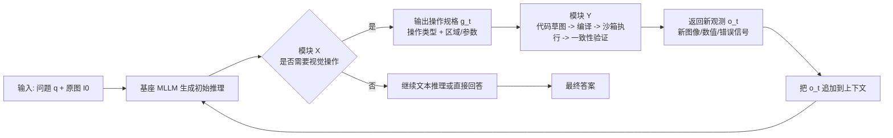
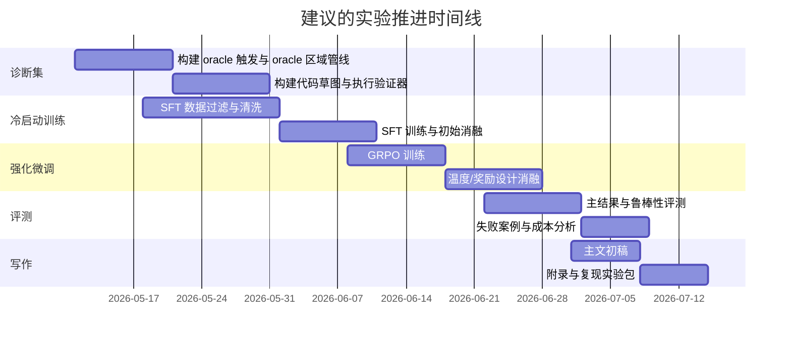

# 将五篇论文重组为一篇可投稿的 a+b+c 论文

## 执行摘要

最值得写成论文的，不是“把 DeepEyes 的裁剪能力和 Thyme 的代码能力拼起来，再去刷一个基准”，而是把五篇文献抽成一个更强的、可验证的中心命题：**当前公开的 thinking-with-images 系统之所以在复杂任务上仍然明显失分，核心不是“工具不够多”，而是“是否该调用工具、该操作哪里、如何把操作写成可执行程序、以及如何验证中间结果”这四件事被纠缠在同一条自回归序列里学习，导致证据获取与证据验证同时失真。** 这一判断与综述提出的“从静态视觉上下文到动态视觉工作空间”的范式转变一致，也与 OpenAI 对 o3/o4-mini 中 zoom、crop、flip、enhance 等操作被嵌入推理链条的官方描述一致。citeturn16view0turn16view1turn23search0

因此，最适合投稿的 **a+b+c** 结构应当写成：**a：诊断 “动作纠缠” 瓶颈；b：模块 X 负责不确定性感知驱动的主动视觉证据获取；c：模块 Y 负责可验证的程序化视觉执行与一致性校验。** 这种叙事既能吸收 DeepEyes 的主动感知与条件奖励，也能吸收 Thyme 的程序化图像操作、代码温度控制与沙箱设计，还能把 TIR-Bench 的“工具使用是必要条件”、WebWatcher 的“轨迹必须内容对齐且可验证”纳入同一条故事线上。citeturn6view0turn22view0turn12view0turn13view1turn15view3turn21view2turn7view1turn7view3

如果只选一条主战线，建议把**主论文核心结果**放在 **TIR-Bench + HR-Bench/V*Bench + 中文的 MMSciBench** 上：前者验证“是否真的会动图像推理”，中者验证“高分辨率局部证据是否被抓住”，后者验证“这种能力是否能外推到中文多模态科学推理”。如果还想把 WebWatcher 这一脉也纳入，则把 **BrowseComp-VL / LiveVQA / MMSearch** 放到附录或扩展实验，作为“现实世界视觉信息检索”外推验证，而不要让主论文在第一版就同时承担“图像内推理”和“开放世界搜索”两个任务。citeturn21view2turn20search1turn26view0turn17search0turn17search3turn7view2turn23search3turn23search2

## 文献归纳与研究空缺

这五篇论文放在一起看，形成的不是五个孤立模块，而是一条很清晰的研究链。综述首先给出总框架：传统 MLLM 的瓶颈在于把图像只当成**一次性输入**，造成“连续视觉世界”与“离散符号推理”之间的语义鸿沟；thinking-with-images 则把图像变成推理中的“动态工作空间”，并将路线划分为**外部工具探索、程序化操作、内生视觉想象**三阶段。citeturn16view0turn16view1

DeepEyes 落在这条路线的前半段。它把模型原生 grounding 能力封装为内部工具，通过 RL 学出交错式多模态 CoT；但作者也明确报告了早期训练时模型**不愿意 zoom-in**、即便 zoom 也经常找错区域，必须靠“感知效用导向的数据筛选”与“仅对正确且用了主动感知的轨迹发奖励的条件 bonus”才能把行为拉起来。更重要的是，DeepEyes 还观察到训练会经历从低效探索到高频交互，再到高效选择性的三阶段演化，这说明“工具是否被正确调用”本身就是学习难点，而不是白送的能力。citeturn6view0turn22view0turn22view1turn22view2

Thyme 则把问题往“程序化操作”推进了一步。它不满足于 crop，而是让模型通过可执行代码自主完成 crop、rotate、contrast enhancement 和数学计算，并通过两阶段训练激活这种能力。关键发现有两个：第一，**代码生成和自然语言推理需要不同采样机制**，文本探索需要较高温度，而代码一旦带来哪怕很小的 token 偏差就可能整体失效，因此 Thyme 用 GRPO-ATS 在代码段把温度降到 0；第二，**奖励设计里真正有帮助的是一致性奖励，而不是过程奖励或代码奖励本身**，因为后两者更容易被“写很多无用代码”或“写好看但没用的推理过程”所 hack。citeturn12view0turn13view1turn15view2turn15view3

TIR-Bench 则把评测短板说得很直白。它指出此前主流 thinking-with-images 评测大多局限在 Visual Search 一类“找到并裁下来”的题型，而真正复杂的 agentic image reasoning 还包括旋转、增强、辅助作图、拼图、比例分析、低照度修复等细粒度操作。其结果也很有说服力：22 个模型里，**最好成绩也只有 46%**；非工具模型整体很弱，而 tool-using 模型显著更强；同时，rotation task 上的函数调用实验表明，模型的工具能力对 prompt 和调用方式非常敏感，**agentic SFT 在旋转 OCR 上明显优于 direct SFT，且能随着数据规模增长，而 direct SFT 不会**。这相当于直接告诉作者：如果论文只做“输入图像 → 最终答案”的 end-to-end 直接映射，往往会把真正需要变换图像才能解决的问题学坏。citeturn21view0turn21view1turn21view2turn21view3

WebWatcher 提供的是另一条重要信号：在现实世界视觉-文本信息检索里，**光有视觉工具不够，光有搜索工具也不够**；更关键的是，轨迹必须是“内容对齐、步骤一致、最少包含一定真实工具交互”的，否则模型很容易靠运气走到正确答案，形成“看起来会用工具，其实并没有”的伪能力。它的三阶段轨迹过滤——终答案匹配、逐步一致性检查、最小工具使用要求——本质上就是在为“中间过程要可验证”这件事立规矩。citeturn2view3turn7view1turn7view2turn7view3

因此，真正的研究空缺不是“再发明一个新工具”，而是：**如何把工具决策、视觉定位、程序实现、结果校验这四层拆开，让模型既知道何时该看、看哪里，也知道何时该动手、动手后如何证明自己不是在乱动。** 这也是建议的论文应当占住的核心空位。citeturn6view0turn12view0turn21view1turn27view0

## 建议的问题定义与诊断路径

建议把论文问题定义成一句非常具体的话：

> **在需要局部放大、旋转校正、对比度增强、辅助绘制或轻量计算的样本上，公开 MLLM 的主要失误并不只是“看不懂”，而是“不会判断是否该操作图像、不会稳定地定位有效区域、不会可靠地把操作写成可执行程序、也不会验证中间结果是否真的支持最终答案”。**

这个定义有足够强的文献支撑。TIR-Bench 证明“只靠静态看图”明显不够；DeepEyes 明示模型会 reluctant zoom 和 wrong-region；Thyme 明示自由代码生成会因高温采样而大幅掉可执行性，并诱发“少写代码/乱写代码”两种偏差；WebWatcher 则展示了如果不做轨迹一致性筛选，模型会把正确答案和正确过程混为一谈。更广义地，V*、HR-Bench 与 HRScene 也都指向同一件事：高分辨率、局部目标、小目标、复杂场景和区域利用，是现有模型系统性薄弱的地方。citeturn21view2turn6view0turn12view0turn15view2turn7view1turn26view0turn26view1turn20search2turn28search0

要把这个问题“证明出来”，建议论文先做诊断，再做方法，而不是上来先报提升。最关键的诊断实验应该是四组。

第一组是**oracle-gap 分解**。对同一批样本分别测：不开工具、只给 oracle 触发信号、只给 oracle 区域、只给 oracle 程序、全部 oracle。若“只换 oracle 区域”就显著涨，说明主要瓶颈在视觉定位；若“只换 oracle 程序”显著涨，说明主要瓶颈在执行可靠性；若“只换 oracle 触发”也涨，说明模型连“是否该动图像”都判断不准。TIR-Bench 的函数调用结果、DeepEyes 的 IoU 演化与 Thyme 的执行稳定性分析都说明这种分解是有意义的。citeturn21view1turn6view0turn22view2turn15view2

第二组是**工具触发校准实验**。定义样本的“真实工具必要性”为“oracle 操作能否显著提升正确率”，再看模型的实际工具调用概率是否随这个必要性单调上升。若高必要性样本上模型仍然大量不调用工具，就是 under-trigger；若低必要性样本上频繁写代码，就是 over-trigger。DeepEyes 的条件奖励与 Thyme 的一致性奖励之所以有效，本质上都在逼近“只有对真正有用的工具行动才给正反馈”的校准目标。citeturn22view0turn22view2turn15view3

第三组是**执行可靠性曲线**。把代码 token 的采样温度从 0 到 1 做 sweep，报告 code pass rate、final accuracy、平均轮数和平均延迟；同时做“自由代码 vs 代码草图/DSL vs 预定义函数”的对照。Thyme 已经给出了强信号：代码段温度降到 0 可以显著减少失效样本，并缓解模型训练中“索性不写代码”的塌缩。TIR-Bench 的 rotation case 也说明“写完整代码”和“只输出函数参数”是两种不同难度层级，应当显式比较。citeturn13view1turn15view2turn21view1

第四组是**过程一致性与幸运猜对分析**。用 WebWatcher 风格的 step-by-step consistency 检查，再加 Thyme 风格的 reasoning-answer consistency grader，统计“答对但过程不支撑”的比例、“代码执行成功但并未改变证据”的比例，以及“重复无效工具调用”的比例。中间过程若不做检查，结论就会不可审计；这也是为什么建议把一致性当作 Y 模块的一部分，而不是附属分析。citeturn7view1turn7view3turn13view3

定性证据则建议做成一个**失败谱系图**：under-trigger、wrong-region、invalid-code、useless-code、answer-process contradiction、hallucination-after-tool、tool-overuse 七类，每类给 3–5 个可复现样例。DeepEyes 已经展示了通过 active perception 缓解 hallucination 的 relevancy-map 分析；Thyme 也把 bad cases 总结为“复杂问题却不写代码、写了无用代码、裁剪不准”三类。这些都非常适合被吸收成论文的定性分析模板。citeturn22view3turn12view0

## 方法设计

### 记号与总体框架

建议把方法写成一个**解耦式策略**，而不是一个“大而全的 agent”。设问题为 \(q\)，原图为 \(I_0\)，第 \(t\) 步状态为

\[
s_t = \bigl(q, I_0, \{(a_\tau, o_\tau)\}_{\tau < t}\bigr),
\]

其中 \(a_\tau\) 是先前动作，\(o_\tau\) 是环境返回的观测。现有很多方法把“是否用工具、区域在哪里、工具怎么写、最终怎么答”都塞进单一的 \(\pi_\theta(a_t \mid s_t)\) 中；建议论文明确提出把动作拆为两段：

\[
a_t = (g_t, p_t), \qquad 
\pi_\theta(a_t \mid s_t)=\pi_X(g_t \mid s_t)\,\pi_Y(p_t \mid s_t, g_t),
\]

其中 \(g_t\) 是**工具决策与视觉操作规格**，由模块 **X** 负责；\(p_t\) 是**程序化实现与验证**，由模块 **Y** 负责。这样，论文的创新点就非常清楚：**X 解决 “要不要动、动哪里、做什么操作”；Y 解决 “怎么稳定地动、动完怎么证明有效”。** 这种分工正好对应综述中的“外部工具探索 + 程序化操作”两阶段，也自然吸收了 DeepEyes 与 Thyme 的两个技术脉络。citeturn16view1turn6view0turn12view0

该图对应的思想与 DeepEyes 的 iMCoT、Thyme 的 model+sandbox 迭代以及 WebWatcher 的 think-act-observe 轨迹是一致的，但这里关键的重组是：**不再让自由代码同时承担“决策”和“实现”两层责任。** citeturn6view0turn12view0turn7view1

### 模块 X

模块 X 建议命名为 **不确定性感知主动视觉器**，英文可写作 **Uncertainty-Guided Active Perception**。其输入是当前隐藏状态 \(h_t\) 与全局视觉 token，输出是一个结构化规格

\[
g_t = (m_t, op_t, r_t, \phi_t),
\]

其中 \(m_t \in \{0,1\}\) 表示是否触发工具，\(op_t\) 表示操作类型，推荐主论文只保留 \(\{\text{crop}, \text{rotate}, \text{enhance}, \text{draw}, \text{calc}\}\) 五类；\(r_t\) 是区域框或空间掩码；\(\phi_t\) 是操作参数，如旋转角、增强强度、辅助线类型等。选择这些操作集合的理由很强：TIR-Bench 的任务本身就覆盖 rotate、contrast、辅助作图、比例分析、拼图等；OpenAI 的官方案例中也明确包含 zoom/crop/flip/enhance；Thyme 则证明这些操作完全可以映射到可执行代码。citeturn21view2turn23search0turn12view0

X 的核心不是“多输出一个框”，而是学习**操作效用**。可以定义

\[
u_X(g_t \mid s_t)=\widehat{\mathbb E}\bigl[\Delta R \mid s_t, g_t\bigr]-\lambda_c \cdot \mathrm{Cost}(g_t),
\]

若 \(\max_{g_t} u_X(g_t \mid s_t) \le 0\)，则不调用工具；否则选择最大效用操作。为了训练这个头，建议使用三类信号。第一类是 **counterfactual label**：在带有标注框、已知旋转角、已知增强需求的数据上，直接比较“有操作”和“无操作”的答题收益。第二类是 **排名损失**：

\[
L_X^{\text{rank}}
=
\log\!\left(1+\exp\bigl(-(u_X(g^+)-u_X(g^-))\bigr)\right),
\]

其中 \(g^+\) 是提升正确率的操作，\(g^-\) 是无效或负收益操作。第三类是 **RL advantage**，把最终正确且真实有帮助的操作规格赋予更高优势。DeepEyes 关于 perception-utility filtering、IoU 演化与条件奖励的经验，正好能为这一模块提供直接经验支撑。citeturn22view1turn22view2

### 模块 Y

模块 Y 建议命名为 **可验证程序执行器**，英文可写作 **Verifiable Program Executor**。它不要求模型从头自由写一长段 Python，而是让模型先输出一个**代码草图或 DSL**，再由编译器补全样板代码、边界裁剪、变量注入与路径保存。其核心映射写为

\[
c_t = \Gamma(z_t, g_t),
\]

其中 \(z_t\) 是模型生成的程序草图，\(\Gamma\) 是编译器/标准化器，\(c_t\) 是最终执行代码。这样做的理由非常充分：Thyme 的沙箱已经证明，小模型最常见的失败并不是“不会想”，而是**格式、边界、变量和 I/O 细节把代码整段写废**；WebWatcher 进一步说明，若不做步骤级内容检查，“看似会用工具”的轨迹会夹杂大量幸运猜对。citeturn14view1turn15view2turn7view1

Y 模块建议包含四个子组件。其一是 **代码草图生成器**，只负责生成语义骨架，如“rotate 90° then OCR”或“crop at box b and zoom by factor 4”；其二是 **编译与修复器**，负责填充 imports、image path、边界裁剪、输出变量名、超时保护；其三是 **执行器**，在 10 秒左右的安全沙箱内运行程序并返回图像或数值结果；其四是 **一致性验证器**，检查 “程序输出是否真的支持当前结论”。Thyme 的 autopep8、AST 边界修复、历史变量保留等做法，和 WebWatcher 的 step consistency check，基本都可以在这里自然吸收。citeturn14view1turn7view1

Y 的训练损失不要奖励“写更多代码”，而要奖励“写对、写少、写得支持结论”：

\[
L_Y
=
\lambda_{\text{exec}} L_{\text{exec}}
+
\lambda_{\text{cons}} L_{\text{cons}}
+
\lambda_{\text{min}} L_{\text{min}},
\]

其中 \(L_{\text{exec}}\) 约束程序可执行，\(L_{\text{cons}}\) 约束“过程—结果一致”，\(L_{\text{min}}\) 约束程序最小化，避免无意义冗长操作。这里最关键的设计点，是把所有额外奖励都**条件化在答对之上**：

\[
R
=
R_{\text{ans}}
+
\lambda_f R_{\text{fmt}}
+
\mathbf 1[\text{correct}]
\left(
\lambda_u R_{\text{util}}
+
\lambda_c R_{\text{cons}}
+
\lambda_e R_{\text{exec}}
\right),
\]

这一点同时得到了 DeepEyes 与 Thyme 的经验支持：前者表明 unconditional tool reward 不如 conditional reward，后者表明 consistency reward 有帮助，而单纯的 process/code reward 容易被投机利用。citeturn22view0turn22view2turn15view3

### 训练目标

训练方案建议明确写成 **冷启动 SFT + 解耦辅助损失 + RL 微调** 三段式。冷启动阶段，用高质量轨迹教模型学会“最后一轮输出”和“不要预测 sandbox 观测”；这几乎可以直接借 Thyme 的经验——sandbox 输出 masked、仅训练 final round、对稀缺计算样本做 annealing。数据方面，则建议结合 DeepEyes 的 difficulty/perception-utility filter 与 WebWatcher 的 final-match / step-consistency / minimum-tool-use filter。citeturn14view1turn14view2turn22view1turn7view1

联合损失可以写成

\[
L
=
L_{\text{SFT}}
+
\lambda_X L_X^{\text{rank}}
+
\lambda_Y L_Y
+
\lambda_{\text{RL}} L_{\text{GRPO}},
\]

其中 RL 目标继续使用 GRPO 一类 group-relative policy update，并显式注明**观测 token 不参与损失与 advantage 计算**；rollout 时对自然语言段采用 \(T_{\text{text}} \approx 1\)，对代码段采用 \(T_{\text{code}} = 0\)，这是最接近 Thyme 已验证经验、且最容易复现的设置。citeturn15view0turn15view2turn9view1

## 理论解释与数学推导

这篇论文最需要的不是很长的定理，而是**几段短而硬的推导**，让审稿人立刻明白“为什么 X 和 Y 应该提升性能”。

第一段推导建议写成**风险分解**。设事件 \(M\) 表示“漏掉关键视觉证据”，事件 \(E\) 表示“程序执行或验证失败”，事件 \(R\) 表示“在证据正确、执行正确的条件下仍然推理失败”。则总错误率满足

\[
\Pr(\hat y \neq y)
\le
\Pr(M)+\Pr(E\mid \neg M)+\Pr(R\mid \neg M,\neg E).
\]

其中，X 的作用主要是降低 \(\Pr(M)\)，Y 的作用主要是降低 \(\Pr(E)\) 并部分降低 \(\Pr(R)\)。若 X 将漏证率从 \(m\) 降到 \(m'\)，Y 将执行失败率从 \(e\) 降到 \(e'\)，则总误差改变量至少有

\[
\Delta \mathcal E
\approx
(m-m') + (e-e') + \text{higher-order terms},
\]

在 \(m'>m\) 与 \(e'>e\) 不成立的前提下，联合模块应当严格优于任一单模块。这个推导不是在证明“必然 SOTA”，而是在证明**错误来源被结构性拆开后，改进方向是可解释的**。DeepEyes、Thyme 与 TIR-Bench 的实验都支持这种误差来源的可分解性。citeturn22view2turn15view3turn21view1

第二段推导建议写成**搜索空间熵分解**。单体式策略把“触发/区域/程序”绑成统一动作 \(A\)，而解耦后变为 \(A=(G,P)\)。信息论上有

\[
H(A\mid s)=H(G\mid s)+H(P\mid G,s).
\]

若 \(G\) 是低维结构化动作，而 \(P\) 在给定 \(G\) 后被编译器/DSL 强约束，则

\[
H(P\mid G,s)\ll H(P\mid s),
\]

意味着策略搜索空间显著收缩，RL 采样的方差也会随之下降。直观类比是：让模型先说“把右下角牌匾裁出来并放大四倍”，再去生成受限代码，远比让它一口气自由写出几十行 Python 更稳定。DeepEyesV2 关于“直接 RL 不能稳定诱导 robust tool use，需要 cold-start 建立工具模式”的观察，可以作为这段推导的现实支撑。citeturn27view0

第三段推导建议写成**代码可执行性概率**。若自由代码长度为 \(L\)，代码 token 的逐位正确概率为 \(p(T)\)，则可执行概率近似

\[
P_{\text{exec}}(T)\approx p(T)^L.
\]

这意味着只要 \(L\) 稍大，哪怕 \(p(T)\) 只小幅下降，整段代码的执行成功率也会指数级下降。若 Y 把自由生成长度降为 \(L_s \ll L\)，并在代码段用 \(T=0\)，则

\[
P_{\text{exec}}^{Y}
\approx
p(0)^{L_s}
\gg
p(T)^L.
\]

这正是 Thyme 的温度分离、编译补全与沙箱修复为什么有效的数学化解释。citeturn13view1turn15view2

第四段推导建议写成**效用驱动的最优触发**。若定义工具行动 \(g\) 的效用为

\[
u(g\mid s)=\mathbb E[\Delta \mathbf 1(\hat y=y)\mid s,g]-\lambda_c \operatorname{Cost}(g),
\]

则策略

\[
g^\star = \arg\max_g u(g\mid s),\qquad
\text{invoke iff } u(g^\star\mid s)>0
\]

在期望意义上至少不劣于“总是调用工具”与“从不调用工具”两种退化策略。它本质上是把 DeepEyes 的“只奖励有用工具行动”思想、Thyme 的“别因为代码可写就写代码”思想，以及 TIR-Bench 对 prompt-sensitive function calling 的现象，用统一的决策论语言表达出来。citeturn22view0turn15view3turn21view1

## 实验方案与复现要求

主论文建议优先使用 **Qwen2.5-VL-7B** 作为主干模型。原因不是“它最强”，而是它有原生定位能力、动态分辨率处理能力，且 DeepEyes、Thyme、WebWatcher、TIR-Bench 的主实验和对照里都频繁使用 Qwen2.5-VL 系列，这能让读者更容易把改进归因到方法本身，而不是 backbone 切换。32B 版本可以作为缩放实验放附录。citeturn23search1turn22view2turn7view2

数据集方面，建议明确区分“主结果”“诊断结果”“扩展结果”。主结果使用 **TIR-Bench**，因为它覆盖 13 类需要真实图像操作的任务，且设计上强调确定性答案与较低污染风险。诊断结果使用 **HR-Bench、V*Bench、HRScene**：HR-Bench 与 V*Bench 可直接量化小目标/高分辨率/视觉搜索收益，HRScene 则能额外检验区域利用、regional divergence 与 lost-in-the-middle。中文外推用 **MMSciBench**，这是最符合“中文可得评测”要求的选择；它已显示现有模型在图文科学题上明显吃力。若要展示现实世界信息检索外推，再附加 **BrowseComp-VL、LiveVQA、MMSearch**。citeturn3view2turn20search2turn26view0turn28search0turn17search0turn17search3turn7view2turn23search3turn23search2

基线不要只放一行“Qwen2.5-VL baseline”。建议至少包含五类：其一，**Direct Answer**，即不开任何工具的 base model；其二，**Fixed Tool Prompting**，即给定固定工具提示但没有 X/Y；其三，**Crop-only**，对应 DeepEyes/V* 一类主动感知；其四，**Code-only**，对应 Thyme/PyVision 一类程序化工具；其五，**Training-free HR baseline**，例如 DC\(^2\)，用于证明提升不只是“多看几块图”这么简单。若做开放世界扩展，则再加入 WebWatcher 风格的多工具代理。citeturn6view0turn12view0turn24search0turn20search2turn2view3

超参数建议写得足够具体，但不必夸张。一个稳妥配置是：SFT 学习率 \(1\text{e-}5\sim2\text{e-}5\)，global batch 128 左右，最长上下文 16k；RL 采用 GRPO，group size 8 或 16，clip 0.2，KL 系数 0.01–0.05；最大交互轮数 5–8；代码段温度 0，文本段温度 0.8–1.0；沙箱超时 10 秒；所有 sandbox 输出与 observation token 在训练损失中 mask。这个范围与 Thyme 的代码执行设定和 WebWatcher 的多回合轨迹范式相容，也和 DeepEyes 的 observation masking 思路一致。citeturn14view1turn15view0turn15view2turn7view1

评价指标必须超出“最终 accuracy”。建议至少同时报告：**工具触发 F1、区域命中率/IoU、代码执行成功率、推理—答案一致性分数、平均工具调用次数、平均响应长度、平均延迟、每题 wall-clock 成本、失败类别分布**。其中 IoU 与 response length 在 DeepEyes 中已经被证明能反映策略从粗放探索到高效利用的演化；代码成功率和一致性分数则分别对应 Thyme 与 WebWatcher 的关键经验。citeturn6view0turn22view2turn15view3turn7view1

复现实验清单应单独列出，不能藏在附录里。最少应公开：数据筛选脚本、工具 schema、编译器规则、沙箱版本、所有 prompt、grader 提示词、随机种子、硬件、训练时长、观测 token mask 策略、温度切换逻辑、错误样例集，以及去污染说明。TIR-Bench 与 WebWatcher 都强调了评测脚本和 deterministic setting；Thyme 与 DeepEyes 也都公开了代码/数据接口，这让“同设置复现”成为现实而不是口号。citeturn25view0turn9view0turn6view0

## 论文结构与表图清单

### 摘要草案

本文建议的摘要不应写成“提出两个模块并取得提升”，而应写成“先诊断，再修复”。一个可直接落地的版本如下：

> 现有 thinking-with-images 方法已经证明，图像可以作为推理中的动态工作空间，而非静态输入；但公开模型在复杂任务上仍表现脆弱。本文首先指出，一个被忽视的核心瓶颈在于：工具触发、视觉定位、程序实现与中间结果验证被耦合在单一自回归策略中学习，导致 under-trigger、wrong-region 与 invalid-code 三类误差相互放大。为此，本文提出解耦式框架 See-Act-Verify，其中模块 X 通过不确定性感知估计工具行动的期望效用，负责决定是否调用工具、调用何种操作以及操作区域；模块 Y 通过代码草图编译、安全沙箱执行与一致性验证，负责将操作稳定落地并审查中间证据。本文进一步从风险分解、动作熵分解与代码可执行性三方面给出性能改进的理论解释，并在 TIR-Bench、HR-Bench、V*Bench 与 MMSciBench 上验证所提方法，在准确率、工具效率、鲁棒性和可审计性上均优于强基线。

### 正文提纲

#### 引言

引言应先用 OpenAI 的官方案例把“thinking with images”从概念上立住，再用 TIR-Bench 的高难度结果、HR-Bench/HRScene 的高分辨率差距，证明现有公开模型远未解决这一问题。然后立刻指出：现有论文通常把注意力放在“增加新工具”上，而本文关注的是“动作纠缠”这一更底层的训练与决策问题。citeturn23search0turn21view2turn20search2turn28search0

#### 相关工作

相关工作不要按论文名堆砌，而要按三条线组织：**主动视觉探索**（V*、DeepEyes）、**程序化图像操作**（Thyme、PyVision）、**多工具视觉信息检索**（WebWatcher、MMSearch、LiveVQA）。最后用综述把这三条线统一到 thinking-with-images 的阶段性路线图上。citeturn26view0turn6view0turn12view0turn24search0turn2view3turn23search2turn23search3turn16view1

#### 方法

方法部分按 “问题形式化 → 模块 X → 模块 Y → 联合训练” 四段写。每段都要明确 integration point：X 在 `<think>` 后做工具决策；Y 在收到规格后编译执行并把结果写回上下文；最终仍由基座 MLLM 给出答案。这里不要泛泛说“我们使用 RL”，而要明确 observation masking、conditional reward、text/code 温度切换。citeturn15view0turn15view2turn22view0turn15view3

#### 理论

理论部分不求大而全，但要给出前文四段推导中的至少三段：风险分解、熵分解、代码可执行性。这样的理论深度足够让论文从“工程经验拼接”跃升为“结构化方法改进”。这也是把 DeepEyes 和 Thyme 从“各自一个技巧”提升为统一理论故事的关键。citeturn6view0turn12view0

#### 实验

实验部分必须先做诊断，再给主结果。顺序建议为：diagnostic oracle gap → 主结果表 → 消融 → 鲁棒性 → 计算成本 → 定性案例 → failure atlas。尤其要把 TIR-Bench 的操作族别和 HR 系诊断基准对应起来，否则“为什么提升”会不够清楚。citeturn21view2turn20search2turn28search0

#### 讨论

讨论部分要主动写局限：第一，仍依赖外部 sandbox；第二，工具触发校准可能受 grader 偏差影响；第三，开放世界搜索和图像内推理若同时优化，容易出现 credit assignment 冲突。把这些局限写出来，会比回避它们更像一篇成熟论文。WebWatcher 与 DeepEyesV2 都给出过这类“需要冷启动、需要轨迹过滤、需要更综合评测”的信号。citeturn7view1turn27view0

### 必备表格

正文应明确要求至少出现下列五张表。第一张表是主结果总表，建议采用如下结构：

| 模型/变体 | TIR-Bench | HR-Bench-4K | HR-Bench-8K | V*Bench | MMSciBench | Tool Trigger F1 | Exec Pass@1 | Avg Tool Calls | Latency |
|---|---:|---:|---:|---:|---:|---:|---:|---:|---:|
| Base MLLM |  |  |  |  |  |  |  |  |  |
| + Fixed Tool Prompt |  |  |  |  |  |  |  |  |  |
| + X |  |  |  |  |  |  |  |  |  |
| + Y |  |  |  |  |  |  |  |  |  |
| + X + Y |  |  |  |  |  |  |  |  |  |
| + Oracle Trigger |  |  |  |  |  |  |  |  |  |
| + Oracle Region |  |  |  |  |  |  |  |  |  |
| + Oracle Program |  |  |  |  |  |  |  |  |  |

第二张表是诊断分解表，专门证明问题存在：

| 变体 | Under-trigger Rate | Wrong-region Rate | Invalid-code Rate | Useless-code Rate | Reason-Answer Contradiction | Hallucination After Tool |
|---|---:|---:|---:|---:|---:|---:|
| Base |  |  |  |  |  |  |
| + X |  |  |  |  |  |  |
| + Y |  |  |  |  |  |  |
| + X + Y |  |  |  |  |  |  |

第三张表是训练消融表，建议聚焦“哪些奖励真的有效”，以回应 DeepEyes/Thyme 的经验：

| 奖励/训练项 | TIR-Bench | HR-8K | Exec Pass@1 | Consistency | Avg Tool Calls |
|---|---:|---:|---:|---:|---:|
| Outcome + Format |  |  |  |  |  |
| + Conditional Utility Reward |  |  |  |  |  |
| + Consistency Reward |  |  |  |  |  |
| + Process Reward |  |  |  |  |  |
| + Code Reward |  |  |  |  |  |
| + Text/Code Temperature Split |  |  |  |  |  |

第四张表是鲁棒性表，按难度轴切开：

| 轴 | 划分 | Base | +X | +Y | +X+Y |
|---|---|---:|---:|---:|---:|
| 目标尺寸 | 小 / 中 / 大 |  |  |  |  |
| 旋转角度 | 0–30 / 30–90 / 90–180 |  |  |  |  |
| 亮度退化 | 轻 / 中 / 重 |  |  |  |  |
| 操作步数 | 1 / 2 / 3+ |  |  |  |  |
| 中文图文科学题 | 文本 / 图文 |  |  |  |  |

第五张表是计算成本表：

| 变体 | SFT GPU Hours | RL GPU Hours | Max Turns | Avg Tokens | Avg Wall Time | Peak Memory |
|---|---:|---:|---:|---:|---:|---:|
| Base |  |  |  |  |  |  |
| +X |  |  |  |  |  |  |
| +Y |  |  |  |  |  |  |
| +X+Y |  |  |  |  |  |  |

### 必备图示

图示至少需要四类。第一类是上面的总体框架图。第二类是**oracle-gap 条形图**，展示“换触发/换区域/换程序”各自能补多少分。第三类是**训练动态曲线**，报告工具调用次数、执行成功率、一致性分数与最终准确率如何共同演化，这一点与 DeepEyes 和 Thyme 的训练分析风格一致。第四类是**失败谱系图**，每一类失败给出一条完整轨迹和中间图像。citeturn22view2turn15view3

### 时间线

## 题目建议与关键主张

建议题目优先选择下面四个版本之一。

**中文题目一**：看准再动手：面向 Thinking-with-Images 的不确定性感知与可验证执行  
**中文题目二**：先取证，再操作，再验证：一种解耦式 Agentic 图像推理框架  
**英文题目一**：See, Act, and Verify: Decoupled Active Perception and Verifiable Execution for Thinking-with-Images  
**英文题目二**：Decoupling Tool Decision and Program Execution in Agentic Image Reasoning

这篇论文最应该坚持的关键主张有四条。

第一条主张是：**公开 agentic MLLM 的主要瓶颈是动作纠缠，而不是工具数量不足。** 这个判断由 DeepEyes 的 reluctant zoom / wrong-region、Thyme 的 invalid-code / useless-code、TIR-Bench 的 function-calling sensitivity 以及 WebWatcher 的 lucky-guess filtering 共同支撑。citeturn22view1turn15view2turn15view3turn21view1turn7view1

第二条主张是：**把“是否/何处/何种操作”交给 X，把“如何实现/如何验证”交给 Y，比单体式自由生成更稳定、更可解释，也更容易训练。** 这条主张既有信息论与可执行性推导，也有现有系统训练现象作为经验佐证。citeturn15view2turn27view0

第三条主张是：**真正有效的训练信号不是鼓励“更多工具调用”或“更长推理过程”，而是鼓励“正确答案条件下的有用操作”和“过程—结论一致”。** DeepEyes 的 conditional bonus 与 Thyme 的 consistency reward 都指向同一结论。citeturn22view0turn22view2turn15view3

第四条主张是：**论文不应只在单一数据集上报分，而应证明改进同时体现为更好的工具触发校准、更高的执行成功率、更低的过程矛盾率、更清晰的失败边界，以及对中文多模态科学题或现实视觉检索任务的外推。** 这也是为什么建议把 TIR-Bench、HR-Bench/V*Bench、MMSciBench 作为主线，把 BrowseComp-VL / LiveVQA / MMSearch 作为扩展。citeturn21view2turn20search2turn26view0turn17search0turn23search3turn23search2

如果只用一句话概括整篇论文应当如何写，那就是：**这不是一篇“新工具论文”，而是一篇“先证明为什么现有模型不会稳定地把图像当作证据，再提出一个把证据获取与证据验证解耦的框架”的论文。** 这条主线最紧、最像贡献，也最有机会避开“只是模块拼接”与“只是 benchmark chasing”的审稿质疑。